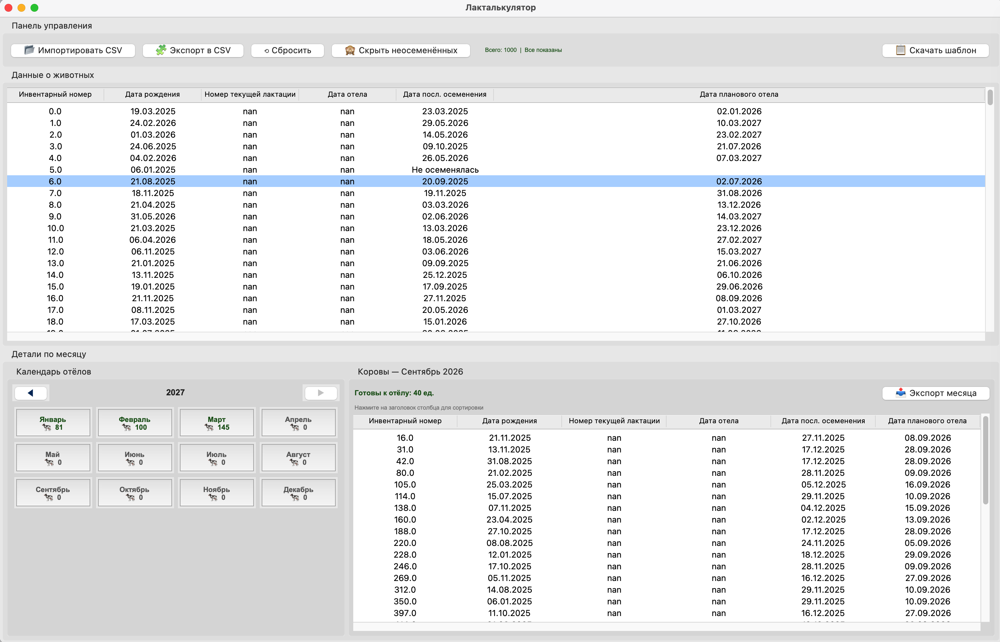
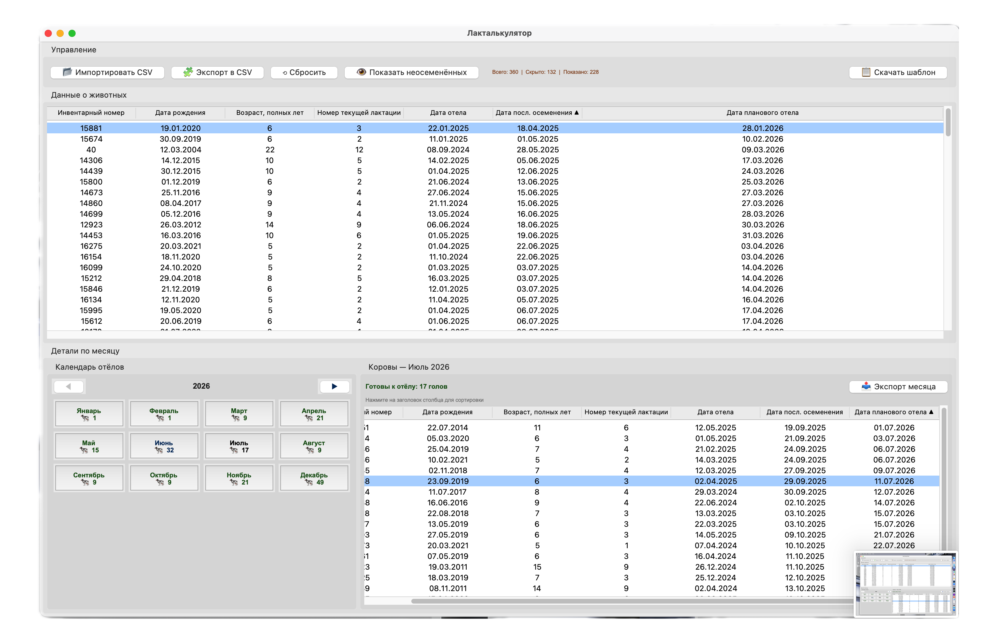
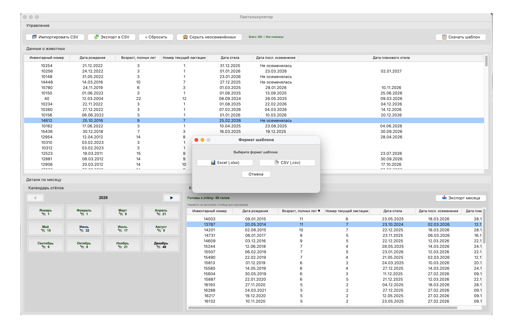

# Программа для аналитики стада КРС по статусу производственного цикла 
Программа для расчёта даты отёла у коров с сортировкой и интерактивным календарём

---

## Описание
У вас есть коровы и вы занимаетесь молоком? Тогда данная программа вам необходима!
Всего за три шага вы сможете получить сводку о ваших коровках, а календарь покажет количество коров готовых к отёлу в нужный вам месяц

Импортируйте таблицу с данными о коровах, программа автоматически рассчитывает дату планового отёла

В программе предусмотрен шаблон по которому можно работать, все табличные данные в формате .CSV

**Основная формула:**
```
Дата последнего осеменения + стельность (285 дней)
```
## Интерфейс приложения





## Функционал

- **Импорт** <таблицы стада>.CSV
- **Экспорт** всей таблицы или выбранного месяца в .CSV
- **Наименование** экспорта автоматически включает количество коров 
- **Шаблон** можно скачать для заполнения
- **Автоматический расчёт** даты планового отёла
- **Календарь** охватывает весь период из загруженной таблицы
- **Список коров по месяцу**
- **Сортировка** по любому столбцу
- **Фильтр** неосеменённых коров - можно скрыть


---

## Тех.требования

- Python 3.10+
- openpyxl

```console
pip install openpyxl
```

Библиотека **Pandas** и **Tkinter** - встроенные библиотеки Python

Запуск:
```console
python laktalkulator.py
```

## Среда разработки

Написание кода в Jupyter Lab
Язык программирования - Python
